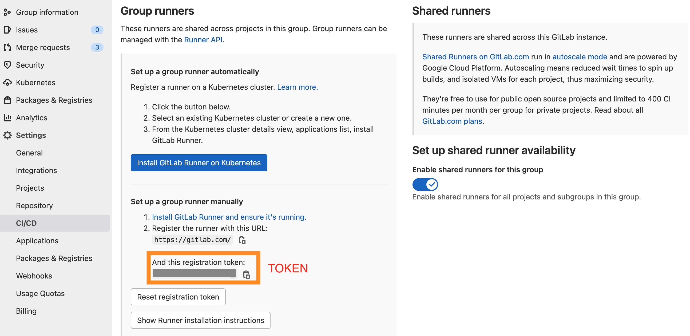
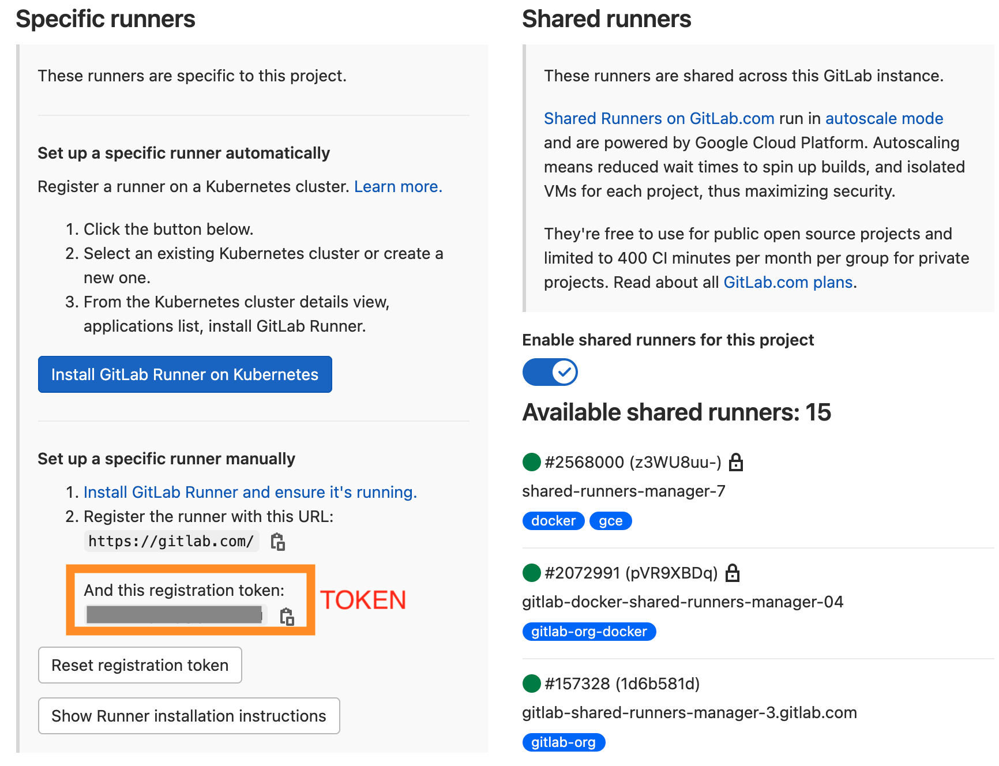

[](https://badge.fury.io/js/cdk-gitlab-runner)
[](https://badge.fury.io/py/cdk-gitlab-runner)

# Welcome to `cdk-gitlab-runner`

This repository template helps you create gitlab runner on your aws account via AWS CDK one line.

## note 
### Will help create a vpc ( only public subnet ) , and one T3.large ec2 Runner (change type feature will update soon ...)

## Before start your need gitlab runner token in your  `gitlab project` or   `gitlab group`

###  In Group
Group > Settings > CI/CD 


###  In Group
Project > Settings > CI/CD > Runners 


## Usage Replace your gitlab runner roken in `$GITLABTOKEN`
```typescript
import { GitlabContainerRunner } from 'cdk-gitlab-runner';
import { InstanceType, InstanceClass, InstanceSize } from '@aws-cdk/aws-ec2';
// If want change instance type to t3.large .
new GitlabContainerRunner(stack, 'testing', { gitlabtoken: '$GITLABTOKEN', ec2type: InstanceType.of(InstanceClass.T2, InstanceSize.LARGE) });
// OR
// Just create a gitlab runner , by default instance type is t3.small .
new GitlabContainerRunner(stack, 'testing', { gitlabtoken: '$GITLABTOKEN' });})
```

```python
# Example python instance type change to t3.small . 
GitlabContainerRunner(self, 'gitlab-runner', gitlabtoken='$GITLABTOKEN',
                              ec2type=InstanceType.of(
                                  instance_class=InstanceClass.BURSTABLE3, instance_size=InstanceSize.SMALL))
```
### see more instance class and size
[InstanceClass](https://docs.aws.amazon.com/cdk/api/latest/docs/@aws-cdk_aws-ec2.InstanceClass.html)

[InstanceSize](https://docs.aws.amazon.com/cdk/api/latest/docs/@aws-cdk_aws-ec2.InstanceSize.html)

## Wait about 6 mins , If success you will see your runner in that page .


#### you can use tag `gitlab` , `runner` , `awscdk`  , 
## Example     _`gitlab-ci.yaml`_  
[gitlab docs see more ...](https://docs.gitlab.com/ee/ci/yaml/README.html)
```yaml
dockerjob:
  image: docker:18.09-dind
  variables:
  tags:
    - runner
    - awscdk
    - gitlab
  variables:
    DOCKER_TLS_CERTDIR: ""
  before_script:
    - docker info
  script:
    - docker info;
    - echo 'test 123';
    - echo 'hello world 1228'
```


### If your want to debug your can go to aws console 
# `In your runner region !!!`
## AWS Systems Manager  >  Session Manager  >  Start a session
#### click your `runner` and click `start session`
#### in the brower console in put `bash` 
```bash
# become to root 
sudo -i 

# list runner container .
root# docker ps -a

# modify gitlab-runner/config.toml

root# cd /home/ec2-user/.gitlab-runner/ && ls 
config.toml

```